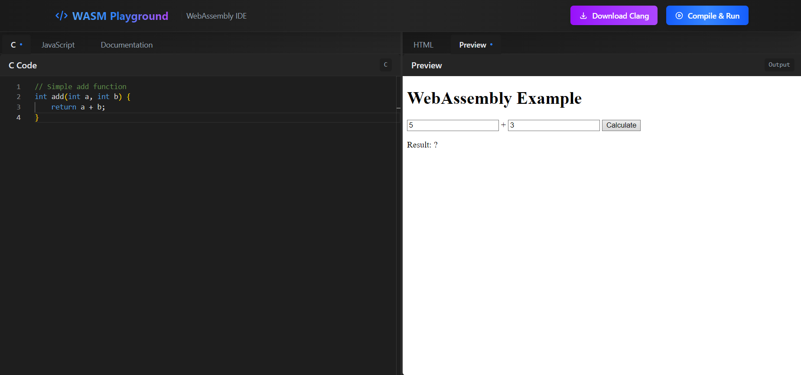

# WASM Playground 🚀

A modern web-based IDE for WebAssembly development, allowing you to write, compile, and test C code directly in your browser.



## Features ✨

- **Live Compilation**: Write C code and compile it to WebAssembly in real-time
- **Multiple Editors**: 
  - C Code Editor
  - JavaScript Editor
  - HTML Preview
- **Built-in Documentation**: Comprehensive WebAssembly compilation guide
- **Modern UI**: Sleek dark theme with responsive layout
- **Split Panels**: Resizable panels for better workspace organization

## Tech Stack 🛠️

- React + TypeScript
- Tailwind CSS
- Monaco Editor
- WebAssembly
- Clang (LLVM)

## Getting Started 🏁

1. Clone the repository:
```bash
git clone https://github.com/yourusername/wasm-playground.git
cd wasm-playground
```

2. Install dependencies:
```bash
npm install
```

3. Run the development server:
```bash
npm run dev
```

4. Open http://localhost:5173 in your browser

## Usage 💡

1. **Download Clang Package**:
   - Click the "Download Clang Package" button when first using the application
   - Wait for the package to initialize

2. **Write Code**:
   - Use the C editor to write your WebAssembly code
   - Write JavaScript code to interact with your WASM module
   - Add HTML markup for visualization

3. **Compile & Run**:
   - Click the "Compile & Run" button to build your WASM module
   - View the results in the Preview panel

## Project Structure 📁

```
src/
├── components/        # React components
├── services/         # Core services (Clang, etc.)
├── store/            # State management
└── styles/           # Global styles and theme
```

## Contributing 🤝

1. Fork the repository
2. Create your feature branch (`git checkout -b feature/amazing-feature`)
3. Commit your changes (`git commit -m 'Add some amazing feature'`)
4. Push to the branch (`git push origin feature/amazing-feature`)
5. Open a Pull Request

## License 📄

This project is licensed under the MIT License - see the [LICENSE](LICENSE) file for details.

## Acknowledgments 👏

- [LLVM Project](https://llvm.org/) for Clang
- [Monaco Editor](https://microsoft.github.io/monaco-editor/) for the code editor
- [React Resizable Panels](https://github.com/bvaughn/react-resizable-panels) for the panel layout

---
Made with ❤️ by [Souhail Bektachi]
